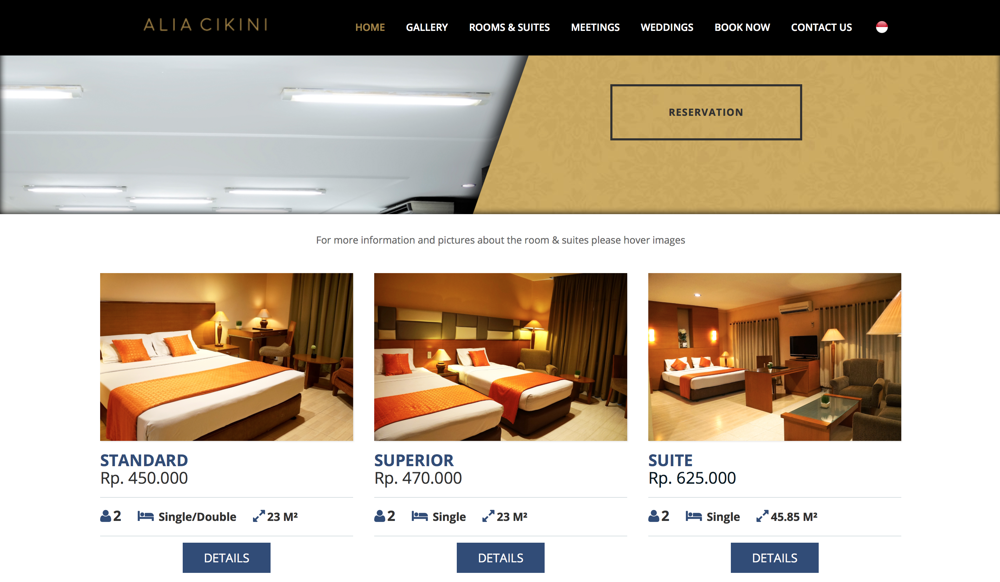
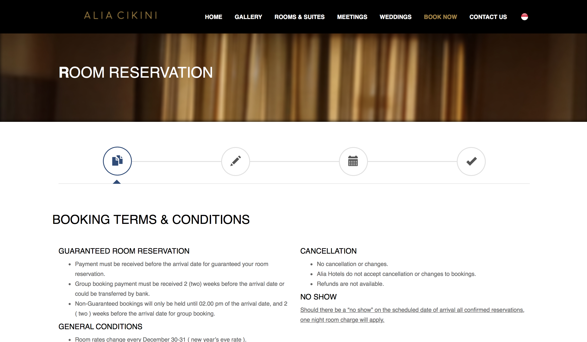
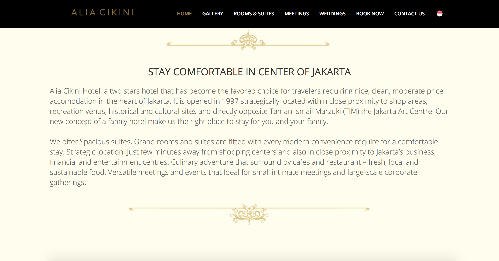
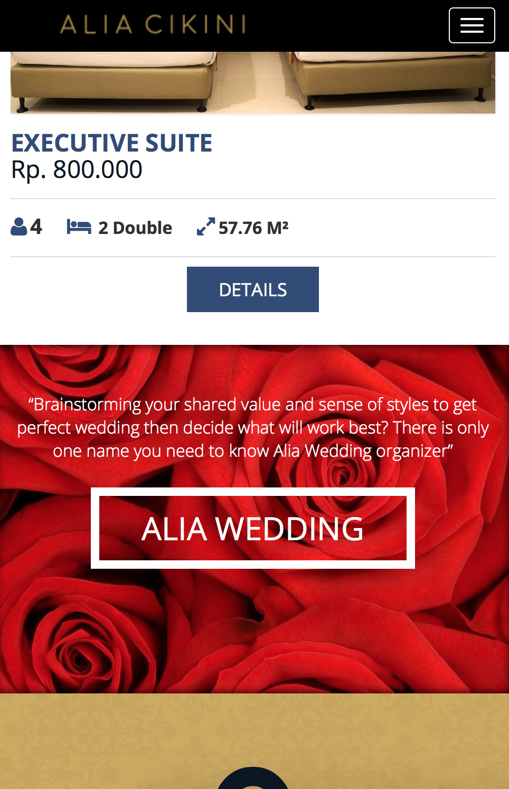
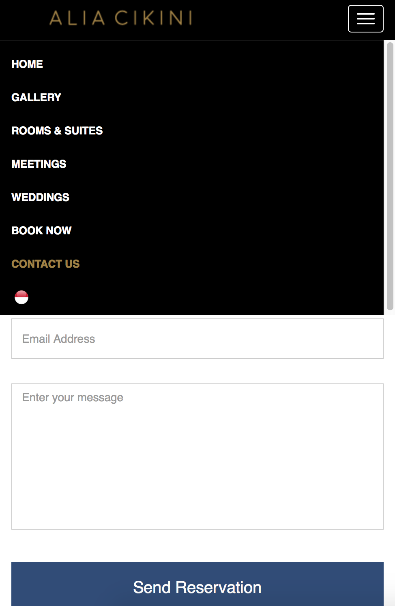

# alia_template

This project was done along my internship at PT Sentralia Alia Grand Hotel during Summer 2017. 
I was responsible for the user interface developement from skretch. The project demand a 
responsive design that able to be pulled up on mobile devices and desktop. Making revisions 
to the design as needed, after agreeing on all the points then proceed to the next phase. Further, followed with the
fully implemented website templates constructed under bootstrap framework using various JS Libraries.

<i>Desktop preview</i>

<i>Responsive design on Mobile preview</i>

                                                     
                                                      
                                                    

<b>LIVE DEMO AVAILABLE VIA DOWNLOAD</b>
